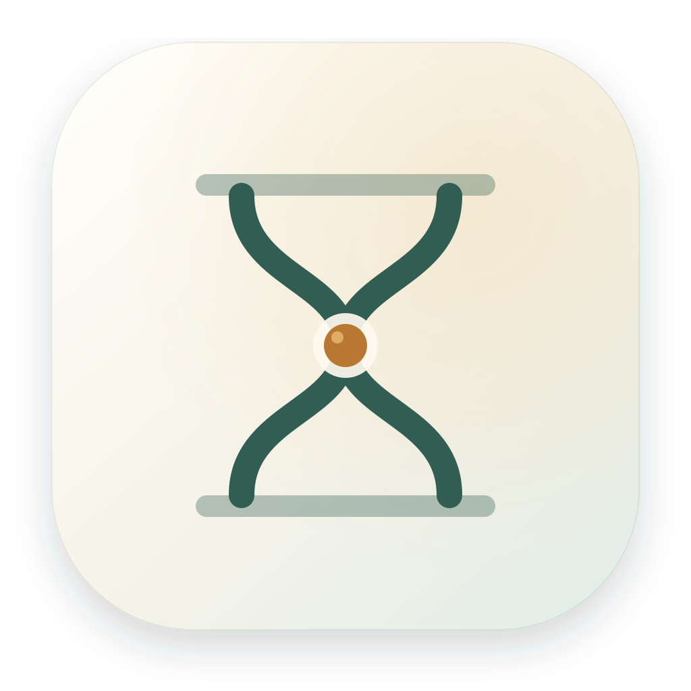
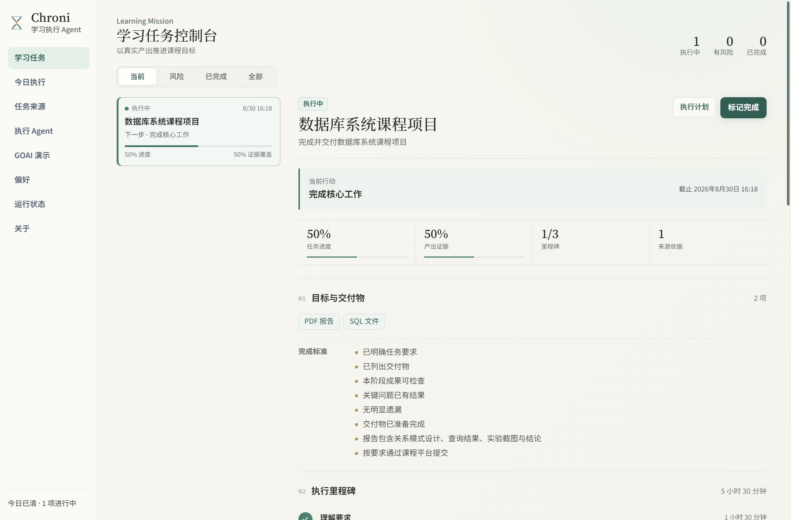

<p align="center"></p>

# Chroni

**A local-first learning execution Agent for evidence-led project-based learning.**

Chroni does not complete coursework for students. It turns course requirements into grounded goals, deliverables, success criteria, milestones, daily actions, output evidence, and checkpoints. Optional OpenAI-compatible models such as DeepSeek improve semantic understanding, while local validation, persistence, tools, and fallback retain authority.



_Actual product UI with isolated synthetic demo data._

[Product and download site](https://getchroni.zeabur.app/) · [GOAI review index](./docs/goai/00-submission-index.md) · [Chinese README](./README.md) · [Evaluation](./docs/goai/07-evaluation-report.md) · [Security](./docs/security/threat-model.md)

## Current version and three-minute path

The repository package version is `0.1.4`. Public installer availability, signatures, and notarization status must be checked on [GitHub Releases](https://github.com/miracle121388-a11y/chroni/releases).

1. Install and start Chroni, then open **GOAI Demo** in the control center.
2. Run scenario A to create a grounded database-course Learning Mission, TaskPlan, output evidence, checkpoint, daily blocks, and Agent trace without an API key.
3. Run B to see a single necessary due-time question; run C to resolve conflicting source deadlines.
4. Export redacted evidence from **Agent**, then exit demo to delete synthetic data and restore the primary Store.

Fixtures are in [`examples/goai`](./examples/goai/). The demo is deterministic, synthetic, isolated, offline-capable, and makes zero model calls.

## Capabilities

| Area | Current implementation |
| --- | --- |
| Intake | TXT, Markdown, CSV/TSV, JSON, ICS, HTML/XML/YAML/RTF, DOCX, PDF, XLSX, and common image formats; local OCR for images/scan text. |
| Grounding | Source records, date validation, deliverables, constraints, conflict/conditional detection, duplicate reconciliation, and resumable clarification. |
| Learning Mission | Stable mission records with goals, deliverables, success criteria, milestones, next action, risk, and linked source evidence. |
| Verification | Local file metadata and SHA-256 or note evidence, milestone-bound checkpoints, actual effort, blockers, and evidence coverage. |
| Learning execution Agent | Ground, Plan, Act, Verify, Adapt loop with risk/slack/capacity scheduling, local tools, and structured trace. |
| Daily execution | Day/multi-day/week/month views, overlapping lanes, duration-aware blocks, zoom, drag/replan, history and future dates. |
| Local-first | Local state and memory, OS-backed key encoding where available, loopback bearer-token API, no hidden analytics. |
| Auditability | On-screen operational trace plus default-redacted JSON/Markdown export with mission inventory and SHA-256. |

## Install for users

Download the platform artifact from [Releases](https://github.com/miracle121388-a11y/chroni/releases) or the [product site](https://getchroni.zeabur.app/). Windows users should prefer the x64 Setup executable; the portable executable requires no installation. macOS users should use the universal DMG. Verify `SHA256SUMS.txt` when available. Unsigned/unnotarized builds may trigger OS warnings; do not disable global security controls.

See [quick start](./docs/user/quick-start.md), [install FAQ](./docs/user/install-faq.md), and [troubleshooting](./docs/user/troubleshooting.md).

## Run from source

Requirements: Node.js 22.13+ and pnpm 11.7.0.

```bash
git clone https://github.com/miracle121388-a11y/chroni.git
cd chroni
npx pnpm@11.7.0 install --frozen-lockfile
npx pnpm@11.7.0 run dev
```

The renderer starts on `http://127.0.0.1:5173`; Electron opens automatically. The local API normally listens on `127.0.0.1:8765`, with actual address/token in the user-data `chroni-api.json` discovery file.

## Optional DeepSeek setup

Open **Preferences → Model service → Custom API**, enable the model, set the base URL to your OpenAI-compatible DeepSeek endpoint, enter your API key, and select a model available to your account. Use **Test connection** before saving. Do not commit keys or post them in issues. Exact provider models and prices change; follow the provider's current console/documentation.

Without a key, explicit deadlines, local OCR/parsing, deterministic planning, reminders, and the GOAI demo remain available. Complex semantics may have lower recall.

## Architecture and API

Chroni is one hybrid Agent, not a claimed multi-Agent system. Models propose bounded candidates; local code controls evidence, validation, state transitions, planning constraints, tools, memory, and fallback. See [technical solution](./docs/goai/03-technical-solution.md), [capability contracts](./docs/goai/agent-capability-contracts.md), and [local API](./docs/local-api.md).

```bash
pnpm run check
pnpm run eval:smoke
pnpm run eval:goai
pnpm run build:goai
pnpm run notices:generate
```

The 60-case report is machine-generated and includes known failures/unmeasured fields. Model evaluation is opt-in and does not run without credentials.

## Security, privacy, and asset rights

Imported files and model output are untrusted data. The renderer has no direct Node access; typed IPC/local API routes validate state changes. Read the [security policy](./SECURITY.md), [threat model](./docs/security/threat-model.md), and [privacy explanation](./docs/goai/06-security-and-privacy.md).

The MIT license covers Chroni first-party code, not every asset/dependency. Optional XIAOTONG character assets have separate additional terms and no separate GOAI/commercial authorization is claimed. Competition-safe builds use the first-party mark:

```bash
pnpm run package:goai:windows
# or pnpm run package:goai:macos
```

See [IP boundary](./docs/goai/05-open-source-and-ip.md), [`THIRD_PARTY_NOTICES.md`](./THIRD_PARTY_NOTICES.md), and the generated dependency inventory.

## Known limitations

Real-image OCR accuracy, credentialed model quality/latency, long-run stability, TaskPlan dependency-cycle metrics, archive expansion hardening, signed Windows distribution, and notarized macOS distribution are not claimed complete. See the roadmap and completion report.

Contributions are welcome through [CONTRIBUTING.md](./CONTRIBUTING.md). Please report vulnerabilities privately according to [SECURITY.md](./SECURITY.md).
