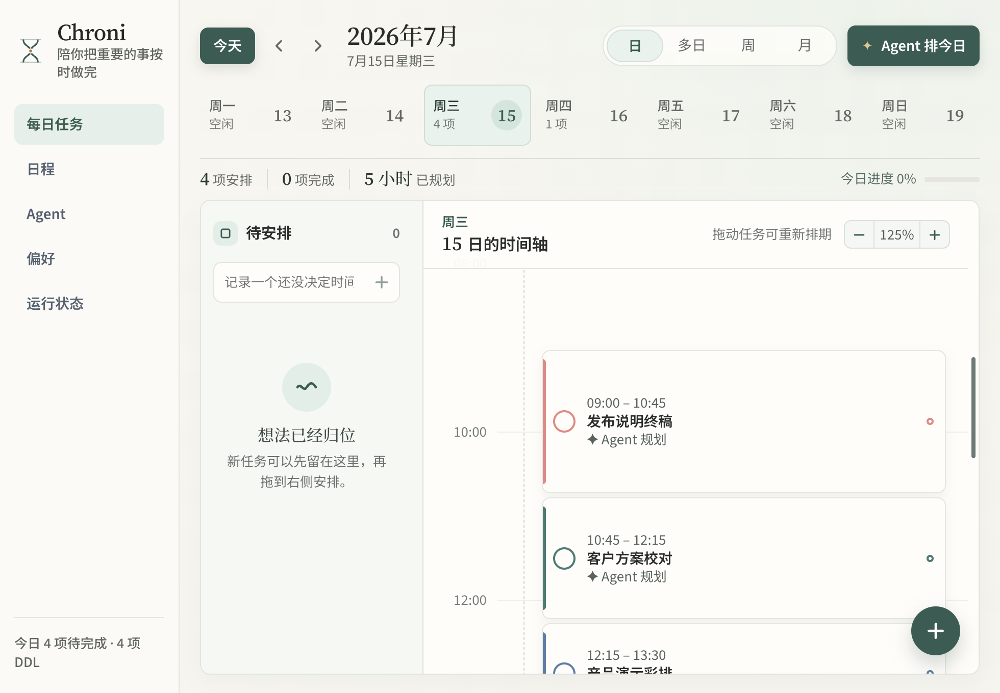
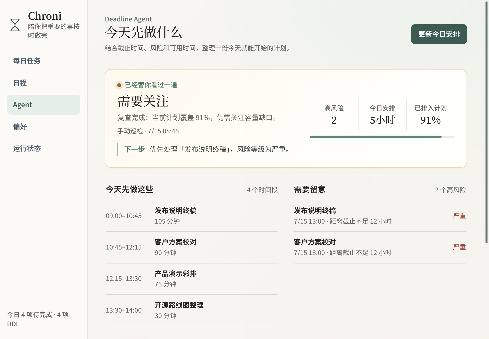
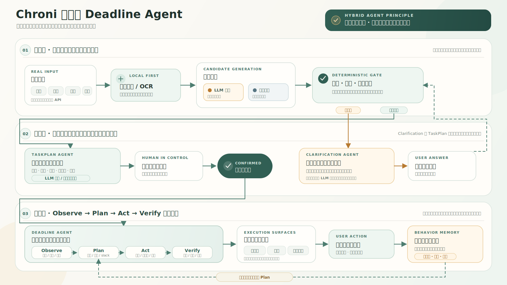

<p align="center">
  
</p>

<h1 align="center">Chroni</h1>

<p align="center">
  <strong>让散落的截止事项，变成今天可以执行的计划。</strong>
</p>

<p align="center">
  Local-first desktop deadline agent for Windows and macOS.<br>
  文件解析、OCR、大模型结构化抽取、任务拆解、每日排程与桌宠提醒，在一个闭环里完成。
</p>

<p align="center">
  <a href="https://github.com/miracle121388-a11y/chroni/actions/workflows/ci.yml"></a>
  <a href="./LICENSE"></a>
  
  
  <a href="https://github.com/miracle121388-a11y/chroni/releases/latest"></a>
</p>

<p align="center">
  <a href="#3-分钟上手">快速上手</a> ·
  <a href="#核心能力">核心能力</a> ·
  <a href="#混合式-agent-架构">Agent 架构</a> ·
  <a href="#下载与安装">下载</a> ·
  <a href="#连接大模型-api">大模型 API</a> ·
  <a href="#开发与验证">开发</a>
</p>



_每日任务视图：按真实时长呈现工作块，并支持拖拽重排、多日、周与月视图。_

## Chroni 做什么

截止信息往往散落在群通知、项目文档、表格、日历和截图中。Chroni 将这些材料统一转换为有来源证据的截止事项（DDL），再拆成任务计划（TaskPlan），安排进每天真正可用的时间，并通过桌宠、日程抽屉和系统通知持续提醒。

```text
材料输入 → 本地解析 / OCR → 语义抽取 → 证据与日期校验
        → 必要时追问 → TaskPlan → 每日时间块 → 提醒 → 完成或重排
```

Chroni 采用混合式 Agent：大模型负责理解复杂语义和提出结构化候选，本地确定性系统负责事实核验、状态变更、容量计算、持久化与失败回退。没有配置大模型时，结构明确的任务仍可通过本地规则完成基础抽取和规划。

仓库公开自研源码、Agent 设计文档、自动化测试与发布工作流；Releases 提供 Windows/macOS 安装包、SHA-256 校验和与构建来源证明。

## 核心能力

| 能力 | Chroni 的处理方式 |
| --- | --- |
| 多格式材料接收 | TXT、Markdown、PDF、DOCX、XLSX、ICS、图片等统一进入同一管线；扫描 PDF 和图片先在本机 OCR。 |
| 有依据的智能抽取 | 保存来源证据并校验标题、日期和字段；明确事项直接进入日程，真正缺失的信息才会追问。 |
| 任务计划生成 | 为每个 DDL 生成可编辑的目标、步骤、耗时、依赖、交付物与缓冲，并保留计划版本。 |
| Deadline Agent | 综合截止时间、剩余工时、依赖、风险和每日容量，执行 `Observe → Plan → Act → Verify` 循环。 |
| 每日执行视图 | 提供日、多日、周、月视图与待安排区；任务按时长占据真实高度，支持拖拽、缩放和重新排期。 |
| 轻量桌面交互 | 左键桌宠查看日程，拖入材料开始识别；动作、气泡、系统通知和托盘状态共同反馈处理进度。 |
| 可控的行为记忆 | 仅从用户明确保存的规划修改中学习偏好；达到证据与置信度门槛后才应用，并可停用、删除或清空。 |
| Local-first | 日程、计划、偏好和结构化执行轨迹保存在本机；API Key 优先交由操作系统安全存储。 |

## 3 分钟上手

1. 从 [Latest Release](https://github.com/miracle121388-a11y/chroni/releases/latest) 安装并启动 Chroni。不开启大模型也可以使用本地规则；需要理解复杂材料时，再按下文连接模型 API。
2. 在“日程”中快速添加，或把包含下面内容的 TXT 文件拖到桌宠上：

   ```text
   今天晚上八点提交项目方案
   ```

   如果当前时间已经超过 20:00，请把“今天”改成“明天”。
3. Chroni 会生成标题“项目方案”和本地时间 20:00 的截止事项。标题与时间已经明确时，不会再次询问“任务叫什么”或“何时截止”。
4. 打开“规划详情”，检查 Agent 生成的步骤、耗时、依赖和缓冲，然后选择“确认并启用”。
5. 进入 Agent 页面点击“帮我安排今天”。Deadline Agent 会把当前可执行步骤写入每日时间轴，并标明高风险任务、覆盖率和规划来源。
6. 完成时间块，或直接调整计划。DDL、TaskPlan 与每日进度会同步更新，后续巡检会基于新状态继续安排。

## 界面预览

### Deadline Agent 工作台

Agent 工作台聚焦三个问题：今天先做什么、哪些任务有风险、当前计划覆盖了多少。模型输出不会直接改写用户数据，必须先通过本地工具和约束校验。



_Deadline Agent 工作台：给出下一步、今日工作块、高风险任务和可审计的执行结果。_

### 桌宠与控制中心

- **左键桌宠**：打开或切换日程抽屉；日程与控制中心窗口均可独立移动。
- **拖入材料**：开始解析、OCR、抽取与规划，桌宠通过动作和气泡反馈所处阶段。
- **完成或调整**：同步更新日程、每日时间块和 TaskPlan 步骤，并触发相应反馈。
- **后台常驻**：关闭控制中心不会退出 Chroni；可以从系统托盘重新打开窗口或完全退出。

## 混合式 Agent 架构

Chroni 的设计原则是：**模型提出候选，本地系统掌握事实与状态变更权。** 这让大模型能力可以被使用、检查和替换，同时保证模型超时、输出非法或未配置时仍有安全回退。



| 环节 | 大模型参与 | 本地确定性职责 |
| --- | --- | --- |
| 信息理解 | 从长文本和跨段要求中提出任务、交付物与时间候选。 | 解析文件与 OCR，核对来源证据、日期、必填字段和重复项；失败时使用规则候选。 |
| 主动追问 | 在确有字段缺失时优化问题与选项表达。 | 决定是否需要追问；用户回答后恢复原流程，明确字段不会被模型降级为“待确认”。 |
| 任务计划 | 提出目标、步骤、依赖、耗时、交付物和不确定性。 | 锁定原始 DDL 与来源约束，检查依赖环、步骤数和总时长；失败时生成可编辑规则计划。 |
| 每日规划 | 可选地提出结构化分配建议和简短行动建议。 | 计算风险、slack、容量和依赖，执行本地工具，持久化更优计划并验证覆盖缺口。 |
| 行为记忆 | 规划时只消费经过筛选的结构化偏好。 | 仅从用户显式保存的计划差异中学习，按证据数与置信度门槛启用。 |

### Deadline Agent 的执行循环

| 阶段 | 读取或执行的内容 | 结果 |
| --- | --- | --- |
| **Observe** | 当前任务、时间、已激活步骤、稍后提醒、工作时段和每日容量。 | 活跃、逾期、暂停和待处理任务快照。 |
| **Plan** | 剩余工时、截止前容量、依赖、缓冲与 slack；大模型建议是可选候选。 | 优先级、风险、每日工作块、溢出时间和规划来源。 |
| **Act** | 比较现有安排，调用重排、持久化与提醒等本地工具。 | 每次工具执行的成功、跳过或失败原因。 |
| **Verify** | 复查高风险覆盖、未安排任务、冲突和容量缺口。 | `healthy`、`attention` 或 `critical` 状态与结构化执行轨迹（Trace）。 |

每次运行都会记录 `plannerSource`（`llm`、`rules` 或 `rules-fallback`）。完整设计与状态流转见[主动追问、任务规划与行为记忆](./docs/agent-clarification-task-planning-memory.md)。

## 下载与安装

前往 [Latest Release](https://github.com/miracle121388-a11y/chroni/releases/latest) 下载。安装包已经包含运行环境，普通用户无需安装 Node.js 或 pnpm。

| 平台 | 推荐文件 | 使用方式 |
| --- | --- | --- |
| Windows 10/11 x64 | `Chroni-<version>-win-x64-setup.exe` | 双击安装，可选择目录，并创建开始菜单与桌面快捷方式。 |
| Windows 10/11 x64 | `Chroni-<version>-win-x64-portable.exe` | 无需安装，放到任意目录直接运行。 |
| macOS 12+ | `Chroni-<version>-mac-universal.dmg` | 同时兼容 Intel 与 Apple Silicon，拖入 Applications。 |

> **系统安全提示：** 当前公开安装包可能尚未配置 Windows 代码签名或 macOS Developer ID 公证，因此系统可能显示 SmartScreen / Gatekeeper 提示。请只从本仓库 Releases 下载，并核对同一发布页中的 `SHA256SUMS.txt`；不要关闭系统全局安全机制。

### 验证下载文件

Windows PowerShell：

```powershell
Get-FileHash ".\Chroni-*-win-x64-setup.exe" -Algorithm SHA256
Get-Content ".\SHA256SUMS.txt"
```

macOS Terminal：

```bash
shasum -a 256 Chroni-*-mac-universal.dmg
grep "mac-universal.dmg" SHA256SUMS.txt
```

两项结果应完全一致。发布页同时提供 GitHub build provenance attestation，用于验证构建来源。

## 连接大模型 API

Chroni 支持 OpenAI-compatible Chat Completions 接口。默认示例使用 DeepSeek；你也可以填写其他兼容服务的 Base URL、模型 ID 和 API Key。大模型主要增强复杂语义抽取、TaskPlan 生成和可选的每日规划，本地规则始终作为基础能力与失败回退。

### 控制中心配置（推荐）

1. 在服务商控制台创建 API Key；DeepSeek 用户可前往 [API Keys](https://platform.deepseek.com/api_keys)。
2. 从托盘打开“控制中心”，进入“偏好”。
3. 展开“高级 → 大模型 API”。
4. `Base URL` 填写 `https://api.deepseek.com`。
5. `模型` 填写 `deepseek-v4-flash`；需要更强模型时可使用 `deepseek-v4-pro`，或填写服务商当前提供的其他模型 ID。
6. 填写 API Key，点击“保存并测试”，测试通过后开启“启用 LLM 抽取”。

模型名称和计费规则可能变化，请以 [DeepSeek API 文档](https://api-docs.deepseek.com/) 或所用服务商文档为准。

### 源码运行使用 `.env`

在项目根目录复制示例文件：

```powershell
# Windows
Copy-Item .env.example .env
```

```bash
# macOS / Linux
cp .env.example .env
```

编辑 `.env`：

```dotenv
CHRONI_LLM_ENABLED=1
CHRONI_LLM_BASE_URL=https://api.deepseek.com
CHRONI_LLM_MODEL=deepseek-v4-flash
CHRONI_LLM_API_KEY=你的_DeepSeek_API_Key
```

`.env` 只供源码开发启动器读取，安装包用户应使用控制中心。系统或终端环境变量优先于 `.env`，`.env` 又优先于控制中心保存的同名配置。修改后重新运行 `pnpm run dev` 或 `pnpm run start`。

> **密钥与费用：** 控制中心保存的 API Key 优先使用 Electron `safeStorage` 交由操作系统安全存储，不会明文写入 `chroni-state.json`。`.env` 是开发机上的明文机密，已被 Git 忽略，请勿提交或分享。模型调用可能按服务商规则计费；可以分别关闭 LLM 抽取、Agent 大模型规划或自动巡检。

> **数据发送范围：** 文件解析和 OCR 先在本机完成。启用模型后，Chroni 会按功能发送解析出的文本、任务元数据、来源摘要和已筛选的结构化偏好；二进制原文件不会直接上传。处理敏感材料前，请确认所用模型服务的隐私政策。

## 支持的输入与本地数据

| 类型 | 格式 |
| --- | --- |
| 文本与结构化文本 | TXT、MD、CSV、TSV、JSON、ICS、LOG、HTML、XML、YAML、RTF |
| 文档与表格 | DOCX、PDF、XLSX |
| 图片 OCR | PNG、JPG/JPEG、WEBP、BMP、TIF/TIFF |
| 输入入口 | 桌宠拖放、控制中心快速添加、本地 HTTP API |

- 单个文档最大 `18 MiB`，纯文本最大 `2 MiB`；HTTP JSON 请求体最大 `32 MiB`。
- TXT 支持 UTF-8、UTF-16、GBK 与 GB18030；XLSX 会读取全部工作表。
- 没有文本层的扫描 PDF 会先渲染页面再 OCR；OCR 可靠性阈值为 `55`。
- 空文件、乱码、非法日期、低置信度 OCR 或缺少任务语义时，会返回具体原因而不是静默写入错误日程。
- 日程、来源、偏好、计划版本和 Agent Memory 保存在 Electron 用户数据目录，可在“运行状态”中打开。
- 执行轨迹只保存结构化摘要、规划来源和工具结果，不保存 API Key、模型隐藏推理或完整原始文档。

## 本地 HTTP API

Chroni 默认只监听 `127.0.0.1:8765`。每次启动都会生成会话令牌；除健康检查外的接口均要求 Bearer 鉴权。实际地址与进程信息写入用户数据目录下的 `chroni-api.json`，退出后自动删除。

API 覆盖文本与文件抽取、日程写入、每日任务、Agent 运行、主动追问、TaskPlan、Behavior Memory 和 ICS 导出。完整端点、安全边界及 Windows/macOS/Linux 示例见[本地 HTTP API 文档](./docs/local-api.md)。

## 已知边界

- 大模型服务不可用时会自动降级，但复杂语义、跨段关联和图片文本理解能力可能降低。
- OCR 效果取决于扫描清晰度、版面与语言；低置信度内容需要人工确认。
- Chroni 负责规划、提醒和记录，不会代替用户上传材料、发送邮件或宣布任务已经完成。
- 当前正式发布 Windows 10/11 x64 与 macOS 12+ Universal 安装包；Linux 用于开发和 CI，暂不承诺公开安装包支持。
- 未签名 macOS 构建的自动更新和系统通知可能受到系统限制，但不影响本地日程、Agent 与桌宠核心流程。

## 开发与验证

### 环境要求

- Windows 10/11、macOS 12+ 或 Linux 开发环境
- Node.js `22.13+`
- pnpm `11.7.0`（也可以直接使用下面固定版本的 `npx` 命令）

### 获取源码并启动

```bash
git clone https://github.com/miracle121388-a11y/chroni.git
cd chroni
npx pnpm@11.7.0 install
npx pnpm@11.7.0 run dev
```

运行本地生产构建：

```bash
npx pnpm@11.7.0 run start
```

关闭控制中心不会退出应用；需要完全退出时，请使用系统托盘菜单。开发终端中可按 `Ctrl+C` 停止。

### 质量检查与打包

```bash
# 类型检查、自动化测试、Electron main 与 renderer 构建
npx pnpm@11.7.0 run check

# 生成当前平台产物
npx pnpm@11.7.0 run package:desktop

# 应在对应原生平台或 CI runner 上执行
npx pnpm@11.7.0 run package:windows
npx pnpm@11.7.0 run package:macos
```

| 验证层级 | 当前基线 |
| --- | --- |
| 自动化测试 | 228 项 Node 测试，覆盖文件接收、中文相对时间、无效模型输出回退、主动追问、TaskPlan、Deadline Agent、Memory、窗口交互、API 安全与打包配置。 |
| 跨平台 CI | 每次提交在 Windows、macOS 和 Linux 上执行类型检查、测试及 Electron main / React renderer 生产构建。 |
| 发布完整性 | Windows 安装版与便携版、macOS Universal DMG 与 ZIP 均由工作流构建，并附带 SHA-256 和 build provenance attestation。 |
| 许可证交付 | 安装包包含 Chroni MIT、桌宠资产许可证与附加条款，以及字体 SIL OFL 1.1 和对应 Notice。 |

### 技术架构

```text
Chroni
├─ apps/desktop
│  ├─ src/main.ts       Electron 生命周期、托盘与 IPC 入口
│  ├─ src/windows.ts    桌宠、日程与控制中心窗口管理
│  ├─ src/api-server.ts 带鉴权的本地 HTTP API
│  ├─ src/renderer      React 控制中心、每日任务、日程和桌宠界面
│  ├─ src/agent         抽取、规划、调度、Memory 与 Deadline Agent
│  ├─ src/shared        类型、时间轴布局和跨进程契约
│  └─ test              跨模块自动化测试
├─ docs                 Agent、API 与发布文档
└─ .github/workflows    三平台 CI 与双端构建
```

核心技术：Electron 42、React 19、TypeScript 6、Vite 8、Tesseract.js、pdf-parse、Mammoth 与 read-excel-file。

### 项目文档

| 文档 | 内容 |
| --- | --- |
| [Agent 设计](./docs/agent-clarification-task-planning-memory.md) | 主动追问、TaskPlan、状态机和 Behavior Memory。 |
| [本地 HTTP API](./docs/local-api.md) | 鉴权、端点、上传示例和安全边界。 |
| [发布指南](./docs/releasing.md) | 版本、签名、公证、标签发布与发布后验证。 |
| [v0.1.4 发布说明](./docs/releases/v0.1.4.md) | 当前公开版本的功能与交付内容。 |
| [贡献指南](./CONTRIBUTING.md) | 开发约定、提交检查与 Pull Request 流程。 |
| [安全策略](./SECURITY.md) | 漏洞报告方式与支持范围。 |
| [更新记录](./CHANGELOG.md) | 用户可见的版本变化。 |

## 参与开发

欢迎通过 [Issues](https://github.com/miracle121388-a11y/chroni/issues) 报告问题或讨论新能力，也欢迎提交 Pull Request。提交前请运行：

```bash
npx pnpm@11.7.0 run check
```

涉及 UI 的改动请同时说明 Windows/macOS 表现，并附上相应截图；每个 Pull Request 尽量保持单一目标，写明用户场景、行为变化与验证方式。

## 致谢与许可证

- Chroni 自研源代码使用 [MIT License](./LICENSE) 开源。
- 桌宠视觉资产来自 [XIAOTONG Desktop Pet / 蓝色小嗵](https://github.com/gildingmazzonimo621-design/XIAOTONG-Desktop-pet)，依据 Apache License 2.0 与 [`ADDITIONAL_TERMS.md`](./apps/desktop/third_party/xiaotong/ADDITIONAL_TERMS.md) 使用；应用内“关于”保留原作版本、作者、联系方式、支持二维码与条款入口。
- Source Serif 4、Source Sans 3、Noto Serif SC 与 Noto Sans SC 字体依据 SIL Open Font License 1.1 分发。

感谢所有参与测试、反馈和贡献的人。

<p align="center">
  <strong>让截止日期不再只是一条提醒，而是一份今天可以开始执行的计划。</strong>
</p>
