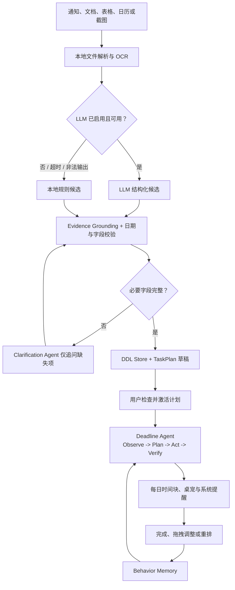

<p align="center">
  
</p>

<h1 align="center">Chroni</h1>

<p align="center">
  <strong>把散落在通知、文档、表格和截图里的 DDL，变成今天真正做得完的计划。</strong>
</p>

<p align="center">
  Local-first desktop deadline agent for Windows and macOS.<br>
  文件解析、OCR、DeepSeek 结构化抽取、任务拆解、每日时间块与桌宠提醒，在一个闭环里完成。
</p>

<p align="center">
  <a href="https://github.com/miracle121388-a11y/chroni/actions/workflows/ci.yml"></a>
  <a href="./LICENSE"></a>
  
  
  <a href="https://github.com/miracle121388-a11y/chroni/releases/latest"></a>
</p>

<p align="center">
  <a href="#3-分钟体验完整闭环">3 分钟演示</a> ·
  <a href="#为什么这是混合式-agent">Agent 架构</a> ·
  <a href="#核心能力">核心能力</a> ·
  <a href="#界面预览">界面预览</a> ·
  <a href="#下载与安装">下载</a> ·
  <a href="#连接-deepseek">DeepSeek</a> ·
  <a href="#开发与打包">开发</a>
</p>


> [!IMPORTANT]
> Chroni 是一个持续迭代的开源桌面 Agent。当前公开安装包可能尚未配置 Windows 代码签名或 macOS Developer ID 公证，因此系统可能显示 SmartScreen / Gatekeeper 提示；请只从本仓库 Releases 下载，并核对 SHA-256 校验和。

## 项目概览

Chroni 不是把一句话转成一条待办的演示程序，而是一个以 **Deadline Agent** 为核心、以桌宠为轻量入口的桌面执行系统。它会先读取真实材料，保留可核验的原文证据，再把明确事项转换为任务、步骤和今日时间块；同一材料中的明确项先落地并规划，缺少必要截止信息的模糊项保留为独立草稿并单独追问。

从“这份材料里有哪些事”到“我今天几点做什么”，Chroni 负责的是完整链路。

| 开源项目能力 | Chroni 的实现 |
| --- | --- |
| 大模型集成 | 接入 OpenAI-compatible Chat Completions；默认示例使用 DeepSeek，参与语义抽取、追问表达、任务拆解和可选的每日规划。 |
| 混合式 Agent | Deadline Agent 具备工具调用、Memory、结构化 Trace、`Observe -> Plan -> Act -> Verify` 循环与失败回退，不是单次 Prompt 包装。 |
| 可执行工作流 | 从通知、文档、表格、日历和截图生成可执行的 DDL、TaskPlan、每日时间块与桌面提醒。 |
| 开放与可复现 | 源码、测试、设计文档、安装包、校验和、构建证明与贡献指南均在本仓库公开。 |

## 3 分钟体验完整闭环

1. 从 [Latest Release](https://github.com/miracle121388-a11y/chroni/releases/latest) 安装并启动 Chroni；需要演示大模型能力时，在“偏好 -> 高级 -> 大模型 API”保存并测试 DeepSeek Key。
2. 在快速添加中输入，或将包含下面内容的 TXT 文件拖到桌宠上：

   ```text
   今天晚上八点提交项目方案
   ```

   如果演示时已经超过 20:00，将“今天”改为“明天”。
3. 预期结果是直接得到标题“项目方案”和本地时间 20:00 的截止任务；标题和截止时间都已明确，因此不应再询问“任务叫什么”或“何时截止”。此类明确字段的识别行为有自动化回归测试覆盖。
4. 打开任务的“规划详情”，检查 Agent 生成的步骤、耗时、依赖和缓冲，然后“确认并启用” TaskPlan。
5. 在 Agent 工作台点击“帮我安排今天”（后续运行显示“更新今日安排”）。Deadline Agent 会综合截止时间、风险、剩余容量和依赖，把当前可执行步骤写入每日时间轴；展开“为什么这样安排”可检查 Trace，并在底部确认本次“规划方式”是大模型、本地规则还是规则回退。
6. 完成时间块或调整计划。日程、TaskPlan 与进度同步更新；显式保存的修改可进入 Behavior Memory，并影响后续规划。

这条路径覆盖 `输入 -> 理解 -> 校验 -> 必要时追问 -> 拆解 -> 激活 -> 排程 -> 提醒 -> 完成 / 重排`，可以用来快速验证 Chroni 的完整工作流。

## 为什么这是混合式 Agent

Chroni 采用“**大模型提出结构化候选，本地系统掌握事实与状态变更权**”的混合架构。不开启 LLM 时，规则管线仍可处理结构明确的任务；开启 LLM 后，复杂语义能力增强，但输出始终要通过本地校验。

| 环节 | LLM 的职责 | 本地确定性职责与回退 |
| --- | --- | --- |
| 语义抽取 | 从长文本、跨段落要求中提出任务、交付物和时间候选。 | 解析文件与 OCR，核对原文证据、日期、字段和重复项；模型失败时使用规则抽取。 |
| 主动追问 | 只为本地已判定缺失的字段优化问题和选项表达。 | 决定是否真的缺字段；明确标题与截止时间不能被模型降级成“待确认”。 |
| TaskPlan | 提出目标、步骤、依赖、耗时、交付物和不确定性。 | 锁定原始 DDL 与来源约束，验证依赖环、时长和步骤数量；失败时生成可编辑规则计划。 |
| Deadline Agent | 可选地给出结构化分配建议和简短建议。 | 计算风险、slack、容量、依赖，调用重排、持久化与提醒工具，并在 Verify 阶段检查覆盖缺口。 |
| Behavior Memory | 规划时只消费已筛选的偏好。 | 仅从用户明确保存的计划修改中学习，按证据数与置信度门槛启用，可停用、删除或清空。 |

### Agent 架构



Deadline Agent 每次运行都会记录结构化 Trace，并把 `plannerSource` 标记为 `llm`、`rules` 或 `rules-fallback`。模型生成的任务候选只有通过原文证据与日期校验才可写入；模型不能直接修改截止时间、来源证据或完成状态。

## 核心能力

| 能力 | Chroni 的处理方式 |
| --- | --- |
| 多格式真实输入 | TXT、Markdown、PDF、DOCX、XLSX、ICS、图片等统一进入同一抽取管线；扫描 PDF 会进入 OCR。 |
| 有依据的智能抽取 | LLM 负责理解复杂语义，本地代码负责证据、字段、日期和容量校验；无法可靠确认时不会静默编造日程。 |
| 明确项先落地，模糊项单独追问 | 同一材料中明确的任务会直接落地并生成计划；模糊日期、条件性事项等保留为独立草稿，避免一个疑问阻塞整份文件。 |
| Agent 主导的任务拆解 | 基于截止时间、剩余工时、工作时段、依赖和缓冲计算风险，生成可编辑、可激活、可追踪版本的 TaskPlan。 |
| 可执行的每日规划 | 日、多日、周、月视图与 Inbox；任务按时长占据真实高度，同一时段自动分栏，并支持拖拽重排、缩放和历史回顾。 |
| 个性化 Behavior Memory | 只从用户明确保存的规划修改中学习；达到独立证据与置信度门槛后才应用，并可随时停用、删除或清空。 |
| 桌面原生提醒 | 桌宠、气泡、右侧日程抽屉、系统通知和托盘协同工作，提醒遵守勿扰时间、频率设置与去重策略。 |
| Local-first 与可集成 | 状态保存在本机，API Key 优先交由系统安全存储；带会话令牌与跨域限制的本地 HTTP API 可接入可信自动化脚本。 |

## 界面预览

### Deadline Agent 工作台

Agent 会说明当前计划覆盖率、风险、今日优先级和下一步，而不是只返回一段无法执行的建议。所有模型输出都必须经过本地工具和约束校验。


### 桌宠与控制中心

- **左键桌宠**：打开或切换日程抽屉；控制中心和日程窗口都可独立拖动。
- **拖入材料**：进入解析、OCR、抽取与规划流程，桌宠会用动作和气泡反馈当前状态。
- **完成任务**：同步更新日程、每日时间块与 TaskPlan 步骤，并触发完成反馈。
- **后台常驻**：关闭窗口不会退出 Chroni；可从系统托盘重新打开控制中心或完全退出。

## Agent 如何工作

| 阶段 | 读取或执行的内容 | 可审计结果 |
| --- | --- | --- |
| **Observe** | 真实任务、当前时间、已激活步骤、稍后提醒状态、工作时段和每日容量。 | 活跃、逾期、暂停和任务总量。 |
| **Plan** | 剩余工时、截止前容量、依赖、缓冲与 slack；LLM 规划在启用时作为可选候选。 | 优先级、风险等级、工作块、溢出分钟数与规划来源。 |
| **Act** | 比较风险优先重排，持久化更优计划，按免打扰、频率和去重规则发送提醒。 | 每次工具调用的成功、跳过或失败原因。 |
| **Verify** | 复查高风险覆盖、未安排优先任务、冲突和容量缺口。 | `healthy`、`attention` 或 `critical` 验证状态与结构化 Trace。 |

每个 DDL 都可以进入“规划详情”工作区：修改步骤、耗时、依赖与状态，查看历史版本，然后显式“确认并启用”。Deadline Agent 只把依赖已满足且未受阻的下一步排进今天，避免把风险任务伪装成已经可执行。

更完整的设计说明见 [主动追问、任务规划与 Behavior Memory](./docs/agent-clarification-task-planning-memory.md)。

## 下载与安装

前往 [Latest Release](https://github.com/miracle121388-a11y/chroni/releases/latest) 下载，无需安装 Node.js、pnpm 或开发工具。

| 平台 | 推荐文件 | 使用方式 |
| --- | --- | --- |
| Windows 10/11 x64 | `Chroni-<version>-win-x64-setup.exe` | 双击安装，可选择目录，并创建开始菜单与桌面快捷方式 |
| Windows 10/11 x64 | `Chroni-<version>-win-x64-portable.exe` | 不安装，直接放到任意目录运行 |
| macOS 12+ | `Chroni-<version>-mac-universal.dmg` | 同时兼容 Intel 与 Apple Silicon，拖入 Applications 即可 |

安装后的 Chroni 会常驻系统托盘。第一次启动可以直接使用本地规则；需要理解复杂通知、图片和跨段落材料时，再在“偏好 -> 高级 -> 大模型 API”中填写 DeepSeek Key。

> [!WARNING]
> 当前未签名的发行包可能触发 Windows SmartScreen 或 macOS Gatekeeper。不要关闭系统全局安全机制；请先核对仓库、版本和校验和，再只对已验证的 Chroni 文件执行系统提供的“仍要运行 / 仍要打开”。后续正式签名版本将配置 Windows 代码签名与 macOS 公证。

配置有效平台签名的安装包会在后台检查 GitHub Releases；新版本下载完成后，“运行状态”页面会出现“重启并安装”，应用不会在工作过程中突然重启。当前未签名版本仍可从托盘发起检查，但 macOS 可能拒绝自动更新，此时请前往 Releases 手动下载安装。

<details>
<summary><strong>验证下载文件</strong></summary>

每个 Release 都包含 `SHA256SUMS.txt`。Windows PowerShell：

```powershell
$Version = "0.1.4"
Get-FileHash ".\Chroni-$Version-win-x64-setup.exe" -Algorithm SHA256
```

macOS：

```bash
VERSION="0.1.4"
shasum -a 256 "Chroni-${VERSION}-mac-universal.dmg"
grep "Chroni-${VERSION}-mac-universal.dmg" SHA256SUMS.txt
```

计算结果应与发布页完全一致。Release 还附带 GitHub build provenance attestation，可使用 GitHub CLI 验证构建来源。

</details>

## 快速开始

以下内容面向希望修改代码或从源码运行的开发者。普通用户请直接使用上方安装包。

### 开发环境要求

- Windows 10/11、macOS 12+ 或 Linux 开发环境
- Node.js `22.13+`
- pnpm `11.7.0`，也可以直接使用下方固定版本的 `npx` 命令

### 1. 获取源码与依赖

```bash
git clone https://github.com/miracle121388-a11y/chroni.git
cd chroni
npx pnpm@11.7.0 install
```

### 2. 启动开发环境

Windows PowerShell：

```powershell
npx pnpm@11.7.0 run dev
```

macOS Terminal：

```bash
npx pnpm@11.7.0 run dev
```

启动完成后，终端会看到：

```text
VITE ready
Chroni desktop shell ready.
Chroni API listening at http://127.0.0.1:8765
```

Chroni 会显示桌宠并常驻系统托盘。关闭控制中心不会退出应用；需要完全退出时，请在托盘菜单选择“退出 Chroni”。开发终端中可使用 `Ctrl+C` 停止。

### 3. 运行本地生产构建

```bash
npx pnpm@11.7.0 run start
```

<details>
<summary><strong>Windows 启动失败或需要分开排查</strong></summary>

`ERR_PNPM_RECURSIVE_RUN_FIRST_FAIL` 是 pnpm 的汇总行，真正原因通常在它上方第一条 `[electron]` 或 `[renderer]` 错误。

可以使用两个 PowerShell 窗口分别运行：

```powershell
# 窗口 1
npx pnpm@11.7.0 --filter @chroni/desktop run dev:renderer

# 窗口 2
npx pnpm@11.7.0 --filter @chroni/desktop run dev:electron
```

项目启动器会清理父终端中的 `ELECTRON_RUN_AS_NODE`。如果直接运行打包后的 `.exe` 仍受该变量影响，可先执行：

```powershell
Remove-Item Env:ELECTRON_RUN_AS_NODE -ErrorAction SilentlyContinue
```

</details>

## 连接 DeepSeek

Chroni 支持 OpenAI-compatible Chat Completions 接口，项目默认配置示例使用 DeepSeek。**安装包用户请使用控制中心**；根目录 `.env` 只由源码开发启动器读取，不是安装包的配置方式。API Key 由用户自行申请，调用可能按服务商规则计费。

### 安装包与源码均可用：控制中心（推荐）

1. 从托盘打开“控制中心”。
2. 进入“偏好”，展开“高级 -> 大模型 API”。
3. `Base URL` 填写 `https://api.deepseek.com`。
4. `模型`填写 `deepseek-v4-flash`；需要更强模型时可填写 `deepseek-v4-pro`，或填写账户当前可用的其他模型 ID。
5. 填写 DeepSeek API Key，点击“保存并测试”。
6. 测试成功后开启“启用 LLM 抽取”。

API Key 优先使用 Electron `safeStorage` 交由操作系统安全存储加密，不会明文写入 `chroni-state.json`；如果当前系统安全存储不可用，Key 只在本次运行的内存中有效。连接测试会发送一个最小真实请求，并区分鉴权、模型、限流、网络和超时错误。

启用 LLM 后，调用不只发生在“保存并测试”或文件抽取：新任务可能自动生成 LLM TaskPlan；“Agent 规划使用大模型”默认开启时，手动安排、启动巡检、每日巡检和任务变化巡检也可能调用模型。希望控制费用时，可在“Agent -> 工作方式与导出”关闭“Agent 规划使用大模型（不影响信息抽取）”，或关闭自动巡检；抽取总开关仍可单独控制。

### 仅源码运行：项目根目录 `.env`

```powershell
# Windows
Copy-Item .env.example .env
```

```bash
# macOS
cp .env.example .env
```

编辑 `.env`：

```dotenv
CHRONI_LLM_ENABLED=1
CHRONI_LLM_BASE_URL=https://api.deepseek.com
CHRONI_LLM_MODEL=deepseek-v4-flash
CHRONI_LLM_API_KEY=你的_DeepSeek_API_Key
```

`.env` 是已被 Git 忽略的明文开发机密，不要提交、截图或分享。使用 `pnpm run dev` 或 `pnpm run start` 重新启动后生效。系统或终端环境变量优先于 `.env`，`.env` 又优先于控制中心保存的同名字段。可在“运行状态”确认当前模型是否就绪。模型名称和接口变化请以 [DeepSeek API 文档](https://api-docs.deepseek.com/) 为准。

> [!NOTE]
> 文件解析和 OCR 先在本机完成；启用 LLM 后，抽取出的文本会发送到你配置的模型服务。关闭 LLM 时本地规则仍可处理结构明确的内容，但复杂语义、跨段落关联和图片文本理解能力会受到限制。

## 支持的输入

| 类型 | 格式 |
| --- | --- |
| 文本与结构化文本 | TXT、MD、CSV、TSV、JSON、ICS、LOG、HTML、XML、YAML、RTF |
| 文档与表格 | DOCX、PDF、XLSX |
| 图片 OCR | PNG、JPG/JPEG、WEBP、BMP、TIF/TIFF |
| 直接输入 | 桌宠拖放、控制中心快速添加、本地 HTTP API |

- 单个文档最大 `18 MiB`，纯文本最大 `2 MiB`。
- TXT 支持 UTF-8、UTF-16、GBK 与 GB18030。
- 没有文本层的扫描 PDF 会先渲染页面，再进行 OCR。
- OCR 可靠性阈值为 `55`；空文件、乱码、非法日期和缺少任务语义时会返回具体原因。
- `/api/extract` 只预览结果，`/api/intake` 会在校验后写入日程。

## 本地 HTTP API

Chroni 默认只监听 `127.0.0.1:8765`。每次启动会生成会话令牌；除健康检查外的接口都要求 Bearer 鉴权。实际地址和进程信息写入 Electron 用户数据目录下的 `chroni-api.json`，退出后自动删除。该机制主要防止误访问并限制浏览器跨域调用，不应被视为对同一系统账户下恶意本地进程的安全边界。

PowerShell 文本抽取示例：

```powershell
$discovery = Get-Content "$env:APPDATA\Chroni\chroni-api.json" | ConvertFrom-Json
$health = Invoke-RestMethod "$($discovery.baseUrl)/api/health"
$headers = @{ Authorization = "Bearer $($health.apiToken)" }

Invoke-RestMethod `
  -Method Post `
  -Uri "$($discovery.baseUrl)/api/extract" `
  -Headers $headers `
  -ContentType "application/json" `
  -Body (@{
    kind = "text"
    text = "7月18日 18:00 前提交实验报告 PDF"
  } | ConvertTo-Json)
```

<details>
<summary><strong>通过 API 上传文件并直接填入</strong></summary>

```powershell
$file = Get-Item "D:\资料\项目计划.xlsx"
$body = @{
  kind = "files"
  files = @(@{
    name = $file.Name
    contentBase64 = [Convert]::ToBase64String([IO.File]::ReadAllBytes($file.FullName))
  })
} | ConvertTo-Json -Depth 4

Invoke-RestMethod `
  -Method Post `
  -Uri "$($discovery.baseUrl)/api/intake" `
  -Headers $headers `
  -ContentType "application/json" `
  -Body $body
```

</details>

<details>
<summary><strong>主要 API</strong></summary>

```text
GET    /api/health
GET    /api/snapshot
GET    /api/daily-tasks
POST   /api/daily-tasks
PATCH  /api/daily-tasks/:id
DELETE /api/daily-tasks/:id
POST   /api/agent/run
GET    /api/agent/latest
PATCH  /api/agent/memory
POST   /api/agent/export-ics
GET    /api/agent/clarifications
POST   /api/agent/clarifications/:id/answer
POST   /api/agent/clarifications/:id/dismiss
GET    /api/intake-drafts/:id
DELETE /api/intake-drafts/:id
GET    /api/items/:id/plan
POST   /api/items/:id/plan
PUT    /api/items/:id/plan
POST   /api/items/:id/plan/regenerate
POST   /api/items/:id/plan/activate
GET    /api/items/:id/plan/revisions
PATCH  /api/agent/behavior-memory
DELETE /api/agent/behavior-memory
POST   /api/agent/behavior-memory/preferences
PATCH  /api/agent/behavior-memory/preferences/:id
DELETE /api/agent/behavior-memory/preferences/:id
POST   /api/extract
POST   /api/intake
PATCH  /api/items/:id
DELETE /api/items/:id
PATCH  /api/preferences
POST   /api/sources/:id/reprocess
```

如需固定令牌，可在启动前设置 `CHRONI_API_TOKEN`。浏览器跨域默认关闭，只有设置精确的 `CHRONI_API_ALLOWED_ORIGIN` 后对应 Origin 才能访问。HTTP JSON 请求体上限为 `32 MiB`；HTTP snapshot 会移除 LLM API Key、来源全文和近期反馈事件。

</details>

## 本地数据与隐私

- 日程、来源、偏好、Agent Memory、计划版本和窗口位置保存在 Electron 用户数据目录。
- 可在“运行状态”中点击“打开本地数据位置”；Windows 默认位于 `%APPDATA%\Chroni`。
- Trace 只记录结构化摘要、规划来源和工具结果，不保存 API Key、模型隐藏推理或完整原始文档。
- Behavior Memory 不读取输入框过程，只使用用户明确保存的结构化规划差异。
- 桌宠位置按显示器工作区保存；分辨率变化或移除显示器后会自动校正到可见区域。
- 开启模型后，Chroni 会按功能发送来源文件名与解析 / OCR 文本（长文可能分块覆盖全文）、任务元数据与来源摘要，以及已筛选的结构化规划偏好；二进制原文件不会直接上传。
- OCR 在本机执行；首次识别可能下载并缓存 Tesseract 中英文语言数据。敏感材料请根据自己的隐私要求决定是否启用 LLM。

## 质量与可复现性

| 检查层级 | 当前质量证据 |
| --- | --- |
| 自动化行为测试 | 227 项 Node 测试覆盖文件接收、中文相对时间、无效 LLM 回退、主动追问、TaskPlan、Deadline Agent、Memory、窗口交互、API 安全与打包配置。 |
| 跨平台 CI | 每次提交在 Windows、macOS 和 Linux 上执行 TypeScript 类型检查、测试、Electron main 构建与 React renderer 构建。 |
| 正式平台打包 | Windows x64 生成安装版与便携版；macOS 生成 Intel / Apple Silicon Universal DMG 与 ZIP。 |
| 发布完整性 | 标签发布重新执行完整检查，生成平台与汇总 SHA-256，并为安装产物附加 GitHub build provenance attestation。 |
| 许可证交付 | 安装包外置包含 Chroni MIT、XIAOTONG Apache-2.0 与附加条款、字体 SIL OFL 1.1 及对应 Notice；应用内 About 保留完整原作信息。 |

## 已知边界

- 使用 LLM 需要用户自备兼容服务的 API Key，并可能产生第三方调用费用；模型不可用时会降级，但复杂语义效果可能降低。
- OCR 结果受扫描清晰度、版面和语言影响；低置信度内容会要求人工确认，不会被当成可靠事实静默写入。
- Chroni 负责规划、提醒和记录，不会代替用户上传材料、发送邮件或宣布任务已经完成；最终 DDL 与完成状态由用户掌握。
- 当前正式支持并发布 Windows 10/11 x64 与 macOS 12+ Universal 安装包；Linux 可用于开发和 CI，但暂不作为公开安装包承诺。
- 当前发行包可能未签名或未公证，系统安全提示不等于文件损坏；请通过 Release 校验和与构建证明确认来源。
- macOS 未签名构建的应用内自动更新和系统通知可能受系统限制；这不影响本地日程、Agent 和桌宠界面的核心流程。

## 技术架构

```text
Chroni
├─ apps/desktop
│  ├─ src/main.ts       Electron 生命周期、托盘与 IPC 入口
│  ├─ src/windows.ts    桌宠、日程与控制中心窗口管理
│  ├─ src/api-server.ts 带鉴权的本地 HTTP API
│  ├─ src/renderer      React 控制中心、每日任务、日程和桌宠界面
│  ├─ src/agent         抽取、规划、调度、Memory 与 Deadline Agent
│  ├─ src/shared        类型、时间轴布局和跨进程契约
│  └─ test              Node 测试与跨模块行为验证
├─ docs                 Agent 设计与项目视觉
└─ .github/workflows    Windows、macOS、Linux CI 与双端构建
```

核心技术：Electron 42、React 19、TypeScript 6、Vite 8、Tesseract.js、pdf-parse、Mammoth 与 read-excel-file。

## 开发与打包

```bash
# 类型检查、测试、main/renderer 构建
npx pnpm@11.7.0 run check

# 生成当前平台的桌面产物
npx pnpm@11.7.0 run package:desktop

# 显式生成 Windows 或 macOS 安装包
npx pnpm@11.7.0 run package:windows
npx pnpm@11.7.0 run package:macos
```

构建产物位于 `apps/desktop/dist-electron/`。CI 在 Windows、macOS 和 Linux 上执行完整检查；`Desktop Release` 工作流可以手动生成 30 天 artifact，也会在推送 `v*` 标签时创建正式 GitHub Release、更新元数据、SHA-256 校验和与构建来源证明。

Windows 公开分发需要代码签名；macOS 公开分发需要 Developer ID 签名与公证。完整的版本、Secrets、强制签名、标签和发布后验证步骤见 [发布指南](./docs/releasing.md)。

<details>
<summary><strong>常见文件识别问题</strong></summary>

- 确认扩展名在支持列表中，且文件不是 `0` 字节。
- 二进制内容即使改名为 `.txt` 也不会被当作文本解析。
- 扫描 PDF 和图片首次 OCR 需要初始化中英文识别数据，通常比纯文本慢。
- XLSX 会读取全部工作表；同一个文件修正后可以再次选择，输入控件会自动重置。
- 控制中心会区分“文件无法读取”“文本无法可靠解析”“OCR 置信度不足”和“没有明确截止时间”。
- DeepSeek 返回空内容时，先在“偏好 -> 高级 -> 大模型 API”执行“保存并测试”，再根据鉴权、模型、限流或网络分类排查。

</details>

## 参与开发

Chroni 仍处于快速迭代阶段，欢迎通过 [Issues](https://github.com/miracle121388-a11y/chroni/issues) 报告问题或讨论新能力，也欢迎提交 Pull Request。开始前请阅读 [贡献指南](./CONTRIBUTING.md)；安全漏洞请按照 [安全策略](./SECURITY.md) 私密报告。

提交前请运行：

```bash
npx pnpm@11.7.0 run check
```

为了让改动更容易审查，请尽量保持单一目标，并在 PR 中写明用户场景、行为变化、验证方式，以及涉及 UI 时的 Windows/macOS 截图。用户可见变化记录在 [CHANGELOG](./CHANGELOG.md)。

## 致谢与许可证

- Chroni 自研源代码使用 [MIT License](./LICENSE) 开源。
- 桌宠视觉资产来自 [XIAOTONG Desktop Pet / 蓝色小嗵](https://github.com/gildingmazzonimo621-design/XIAOTONG-Desktop-pet)，依据 Apache License 2.0 与 [`ADDITIONAL_TERMS.md`](./apps/desktop/third_party/xiaotong/ADDITIONAL_TERMS.md) 使用；附加条款包含署名、About 保留和未经许可不得商业使用等要求。
- Source Serif 4、Source Sans 3、Noto Serif SC 与 Noto Sans SC 字体依据 SIL Open Font License 1.1 分发。

感谢所有参与测试、反馈和贡献的人。

<p align="center">
  <strong>让截止日期不再只是一条提醒，而是一份今天可以开始执行的计划。</strong>
</p>
