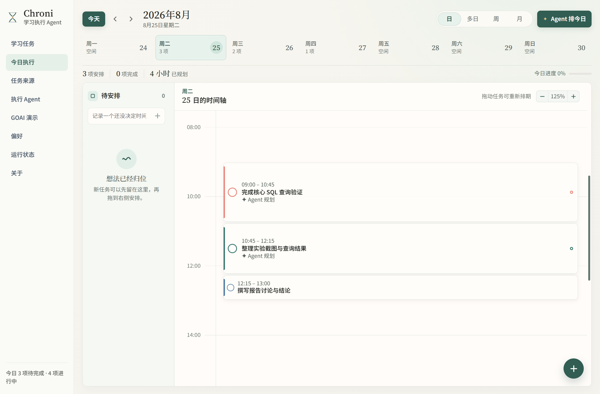
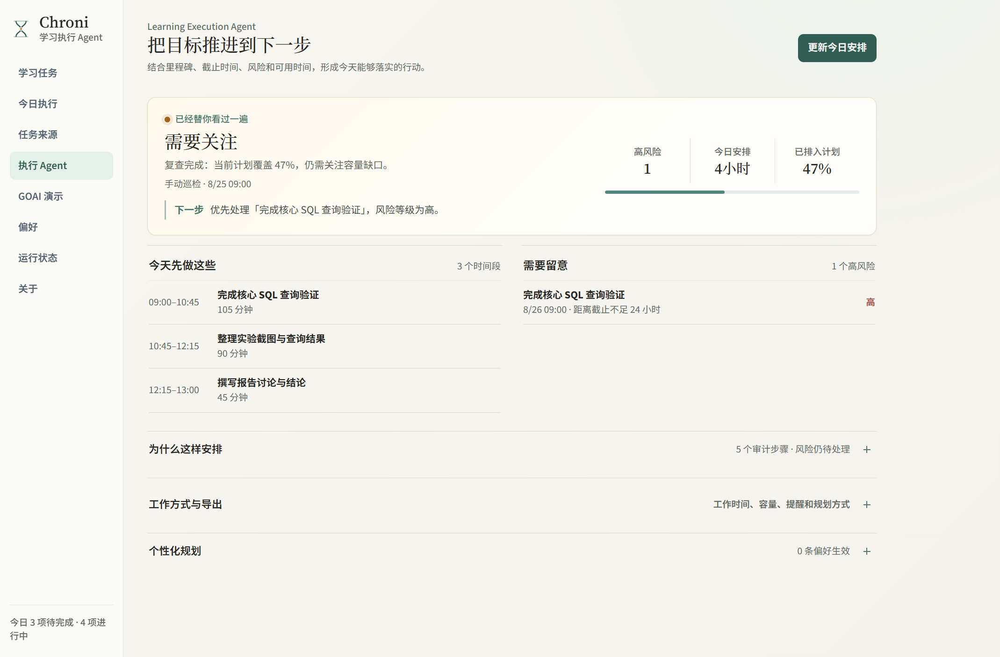
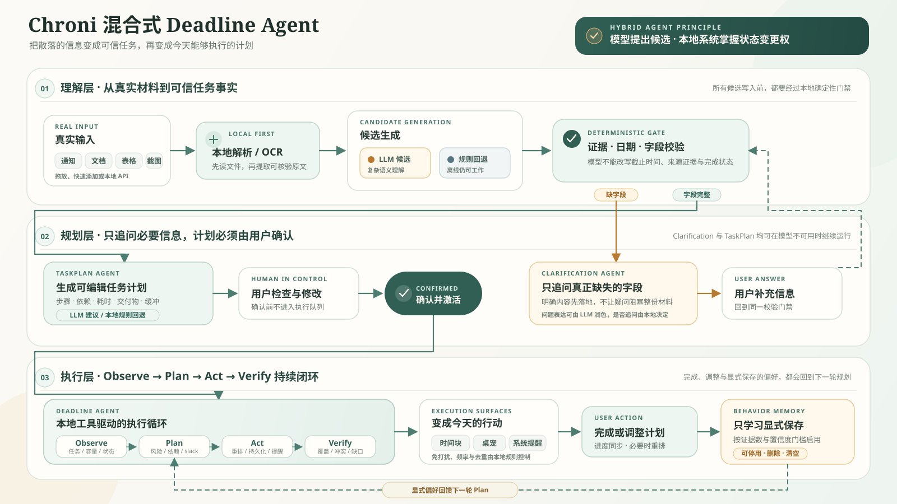

<p align="center">
  
</p>

<h1 align="center">Chroni</h1>

<p align="center">
  <strong>面向大学项目制学习的本地学习执行 Agent。</strong>
</p>

<p align="center">
  Local-first learning execution agent for Windows and macOS.<br>
  不替学生完成作业，而是把课程要求转化为可执行、可验证、可调整的学习过程。
</p>

<p align="center">
  <a href="https://github.com/miracle121388-a11y/chroni/actions/workflows/ci.yml"></a>
  <a href="./LICENSE"></a>
  
  
  <a href="https://github.com/miracle121388-a11y/chroni/releases/latest"></a>
</p>

<p align="center">
  <a href="https://getchroni.zeabur.app/"><strong>产品主页与下载</strong></a> ·
  <a href="./README.en.md">English</a> ·
  <a href="#3-分钟上手">快速上手</a> ·
  <a href="./docs/user/quick-start.md">用户指南</a> ·
  <a href="#核心能力">核心能力</a> ·
  <a href="#桌宠伙伴">桌宠伙伴</a> ·
  <a href="#学习执行-agent-架构">Agent 架构</a> ·
  <a href="#下载与安装">下载</a> ·
  <a href="#连接大模型-api">大模型 API</a> ·
  <a href="#开发与验证">开发</a>
</p>

> **当前版本：** `0.2.1`。公开安装包包含完整的桌宠动画、控制中心与本地优先数据能力；签名、公证和可下载产物以 [Releases](https://github.com/miracle121388-a11y/chroni/releases) 为准。

> **资产许可提示：** MIT 许可覆盖 Chroni 自研代码，不自动覆盖字体、运行依赖与桌宠视觉素材；完整边界见 [第三方声明](./THIRD_PARTY_NOTICES.md)。


_真实产品界面，使用隔离演示数据：一条课程任务被组织为目标、交付物、完成标准、执行里程碑、产出证据与检查点。_

## Chroni 做什么

课程项目真正困难的部分，通常不是“记住截止时间”，而是从分散材料中理解要求、把目标拆成可执行路径、在现实时间里持续推进，并知道自己的产出是否已经满足标准。Chroni 将每项课程要求组织成一条 **Learning Mission**，让任务从通知进入可验证的学习执行闭环。

```text
课程材料 → Ground 事实与边界 → Plan 目标、里程碑与完成标准
        → Act 今日可执行步骤 → Verify 产出证据与检查点
        → Adapt 识别阻塞、调整计划 → 用户确认并继续执行
```

DDL 是触发器，不是产品终点；桌宠是环境交互界面，不是独立装饰。Chroni 采用混合式 Agent：大模型负责理解复杂语义和提出结构化候选，本地确定性系统负责来源核验、状态变更、容量计算、证据登记、持久化与失败回退。没有配置大模型时，结构明确的任务仍可通过本地规则完成基础抽取和规划。

Chroni 不生成可冒充学生完成的作业，不把原始材料当成学习成果，也不会因为时间块结束就宣称任务完成。完成状态由用户确认，并由本地登记的文件元数据、摘要校验和、说明与阶段检查点支持回顾。

仓库公开自研源码、Agent 设计文档、自动化测试与发布工作流；Releases 提供 Windows/macOS 安装包、SHA-256 校验和与构建来源证明。

## 核心能力

| 能力 | Chroni 的处理方式 |
| --- | --- |
| 多格式材料接收 | TXT、Markdown、PDF、DOCX、XLSX、ICS、图片等统一进入同一管线；扫描 PDF 和图片先在本机 OCR。 |
| 有依据的材料理解 | 保存来源证据并校验标题、日期、交付物与限制；明确事项直接建档，真正阻断执行的信息才会追问。 |
| Learning Mission | 将课程要求组织为目标、交付物、完成标准、里程碑、当前行动与风险状态，持续关联来源和 TaskPlan。 |
| 产出证据与检查点 | 可登记本地文件元数据与 SHA-256 或文字说明，并将“顺利、受阻、完成”反馈绑定到具体里程碑。 |
| 学习执行 Agent | 综合剩余工作、证据覆盖、阶段反馈、风险和每日容量，运行 `Ground → Plan → Act → Verify → Adapt` 闭环。 |
| 每日执行视图 | 提供日、多日、周、月视图与待安排区；任务按时长占据真实高度，支持拖拽、缩放和重新排期。 |
| 环境式桌面交互 | 左键桌宠查看日程，拖入材料开始识别；动作、气泡、系统通知和托盘状态共同呈现 Agent 进度。 |
| 可控的行为记忆 | 仅从用户明确保存的规划修改中学习偏好；达到证据与置信度门槛后才应用，并可停用、删除或清空。 |
| Local-first | 学习任务、证据元数据、计划、偏好和结构化执行轨迹保存在本机；API Key 优先交由操作系统安全存储。 |

## 3 分钟上手

1. 从 [Latest Release](https://github.com/miracle121388-a11y/chroni/releases/latest) 安装并启动 Chroni。不开启大模型也可以使用本地规则；需要理解复杂、跨段材料时，再按下文连接模型 API。
2. 在“任务来源”中选择文件，或把[课程作业示例](./examples/demo/01-course-assignment.txt)拖给桌宠。也可以直接输入：

   ```text
   今天晚上八点提交项目方案
   ```

   如果当前时间已经超过 20:00，请把“今天”改成“明天”。
3. Chroni 会建立一条 Learning Mission，并保留原始来源。标题与时间已经明确时，不会再次询问“任务叫什么”或“何时截止”。
4. 在“学习任务”中检查目标、交付物、完成标准和里程碑；再打开“执行计划”确认步骤、耗时与缓冲。
5. 进入“今日执行”点击“智能安排”。Chroni 会把当前可执行步骤写入每日时间轴，并标明高风险任务、覆盖率和规划来源。
6. 完成一个阶段后，登记产出文件或文字证据，并提交一次阶段检查点。Chroni 会同步里程碑状态、任务进度和下一步；如果受阻，则保留原因供后续重排。

这条体验路径不要求 API Key。完整的安装、桌宠入口、预览与填入区别、Demo 材料和退出方式见 [Chroni 3 分钟快速开始](./docs/user/quick-start.md)。

## 界面预览

### Learning Mission 控制台

任务不再只剩标题和截止时间。控制台将来源、目标、交付物、完成标准、执行里程碑、产出证据和阶段反馈放在同一条任务档案里。


_产出文件只登记元数据和 SHA-256，不在状态文件中保存本地路径；原始课程材料也不会被计入成果证据。_

### 每日执行时间轴



_任务按真实时长呈现，并支持拖拽重排、重叠任务分栏、时间轴缩放，以及日、多日、周、月回顾。_

### 学习执行 Agent 工作台

Agent 工作台聚焦三个问题：今天先做什么、哪些任务有风险、当前计划覆盖了多少。模型输出不会直接改写用户数据，必须先通过本地工具和约束校验。



_学习执行 Agent 工作台：给出下一步、今日工作块、高风险任务和可审计的执行结果。_

## 桌宠伙伴

Chroni 的桌宠是一只安静的蓝色毛绒伙伴，也是学习执行 Agent 留在桌面环境中的轻量入口。它不会用持续弹窗打断工作，而是把“正在理解材料、正在规划、需要注意、已经完成”等系统状态变成自然的动作与短气泡。即使控制中心关闭，用户仍能从桌面上感知任务进度，并在需要时立即回到日程。

<table>
  <tr>
    <td align="center" width="33%">
      <br>
      <strong>安静陪伴</strong><br>
      <sub>待机时保持克制，偶尔在桌面散步</sub>
    </td>
    <td align="center" width="33%">
      <br>
      <strong>阅读材料</strong><br>
      <sub>文件解析、OCR 与 Agent 规划进行中</sub>
    </td>
    <td align="center" width="33%">
      <br>
      <strong>理解文字</strong><br>
      <sub>拖入文字后，用动作反馈接收状态</sub>
    </td>
  </tr>
  <tr>
    <td align="center" width="33%">
      <br>
      <strong>随手放置</strong><br>
      <sub>抓起、移动、贴边并记住显示器位置</sub>
    </td>
    <td align="center" width="33%">
      <br>
      <strong>点击回应</strong><br>
      <sub>一次点击获得回应并打开日程抽屉</sub>
    </td>
    <td align="center" width="33%">
      <br>
      <strong>自然休息</strong><br>
      <sub>关闭或隐藏前用完整动画平滑退场</sub>
    </td>
  </tr>
</table>

桌宠交互并不是独立于任务系统的装饰动画，而是与 Chroni 的执行闭环直接相连：

- **点击即达**：左键立即打开或收起桌宠旁的日程抽屉；睡眠状态下会先唤醒，双击还会触发额外互动。
- **拖放即输入**：把文件或文字直接拖到桌宠上即可开始抽取。文件进入阅读动作，文字进入进食动作，气泡会持续报告接收、处理或失败原因。
- **动作即状态**：Agent 理解材料时进入学习动作，阶段风险升高、任务逾期或需要补充信息时主动唤醒，用户确认完成后播放庆祝动作。
- **移动有边界**：拖动采用稳定阈值与固定起点计算，释放后平滑落下并吸附屏幕边缘；位置按显示器工作区保存，分辨率、缩放或多屏布局变化后仍会回到可见区域。
- **提醒有分寸**：桌宠气泡与系统通知共享勿扰时段、提醒频率和去重规则；关闭控制中心不会中断 Agent，也不会让提醒失去上下文。
- **窗口相互配合**：日程抽屉跟随桌宠定位并保持在当前显示器可见区域；控制中心和日程窗口可以独立移动，Windows 与 macOS 使用一致的点击、拖放和恢复逻辑。

## 学习执行 Agent 架构

Chroni 的设计原则是：**模型提出候选，本地系统掌握事实、证据与状态变更权。** 这让大模型能力可以被使用、检查和替换，同时保证模型超时、输出非法或未配置时仍有安全回退。



| 环节 | 大模型参与 | 本地确定性职责 |
| --- | --- | --- |
| Ground | 从长文本和跨段要求中提出任务、交付物、完成标准与时间候选。 | 解析文件与 OCR，锁定来源证据、日期、必填字段和重复项；失败时使用规则候选。 |
| 主动追问 | 在确有字段缺失时优化问题与选项表达。 | 决定是否需要追问；用户回答后恢复原流程，明确字段不会被模型降级为“待确认”。 |
| Plan | 提出目标、步骤、耗时、交付物、完成标准和不确定性。 | 锁定原始来源约束，检查步骤、耗时与版本，生成稳定的 Learning Mission 和可编辑计划。 |
| Act | 可选地提出结构化分配建议和简短行动建议。 | 计算风险、slack 和容量，执行本地工具，将里程碑排入真实可用时间。 |
| Verify | 仅辅助总结阶段反馈，不得自行宣布任务完成。 | 登记产出文件元数据、SHA-256、说明与检查点，将反馈绑定到具体里程碑。 |
| Adapt | 可选地辅助归纳阻塞与调整建议。 | 根据实际投入、受阻原因、证据覆盖和剩余容量重算下一步，并保留用户控制权。 |
| 行为记忆 | 规划时只消费经过筛选的结构化偏好。 | 仅从用户显式保存的计划差异中学习，按证据数与置信度门槛启用。 |

### Ground → Plan → Act → Verify → Adapt

| 阶段 | 读取或执行的内容 | 结果 |
| --- | --- | --- |
| **Ground** | 课程材料、来源片段、日期、交付物、限制与不确定性。 | 有出处的任务事实；只有阻断执行的缺失项才进入追问。 |
| **Plan** | 目标、完成标准、里程碑、预计耗时、缓冲和截止前容量。 | 可编辑的 TaskPlan 与稳定 Learning Mission。 |
| **Act** | 当前可用时间、步骤依赖、优先级和现有日程。 | 今日工作块、提醒和每次本地工具执行结果。 |
| **Verify** | 用户登记的产出证据、实际投入、阶段状态与覆盖缺口。 | 里程碑进度、证据覆盖率、阻塞原因和结构化 Trace。 |
| **Adapt** | 风险、冲突、反馈、剩余工时与行为偏好。 | `healthy`、`attention` 或 `critical` 状态，以及重新计算的下一步。 |

每次运行都会记录 `plannerSource`（`llm`、`rules` 或 `rules-fallback`），Learning Mission 同时保留来源数量、里程碑、证据覆盖和检查点。完整设计与状态流转见[主动追问、任务规划与行为记忆](./docs/agent-clarification-task-planning-memory.md)。

## 下载与安装

前往 [Latest Release](https://github.com/miracle121388-a11y/chroni/releases/latest) 下载。安装包已经包含运行环境，普通用户无需安装 Node.js 或 pnpm。

第一次安装、选择 Setup/Portable、处理 SmartScreen 或 Gatekeeper 前，请查看[安装 FAQ](./docs/user/install-faq.md)。

| 平台 | 推荐文件 | 使用方式 |
| --- | --- | --- |
| Windows 10/11 x64 | `Chroni-<version>-win-x64-setup.exe` | 双击安装，可选择目录，并创建开始菜单与桌面快捷方式。 |
| Windows 10/11 x64 | `Chroni-<version>-win-x64-portable.exe` | 无需安装，放到任意目录直接运行。 |
| macOS 12+ | `Chroni-<version>-mac-universal.dmg` | 同时兼容 Intel 与 Apple Silicon，拖入 Applications。 |

> **系统安全提示：** 当前公开安装包可能尚未配置 Windows 代码签名或 macOS Developer ID 公证，因此系统可能显示 SmartScreen / Gatekeeper 提示。请只从本仓库 Releases 下载，并核对同一发布页中的 `SHA256SUMS.txt`；不要关闭系统全局安全机制。

### 验证下载文件

Windows PowerShell：

```powershell
Get-FileHash ".\Chroni-*-win-x64-setup.exe" -Algorithm SHA256
Get-Content ".\SHA256SUMS.txt"
```

macOS Terminal：

```bash
shasum -a 256 Chroni-*-mac-universal.dmg
grep "mac-universal.dmg" SHA256SUMS.txt
```

两项结果应完全一致。发布页同时提供 GitHub build provenance attestation，用于验证构建来源。

## 连接大模型 API

Chroni 支持 OpenAI-compatible Chat Completions 接口。大模型主要增强复杂语义抽取、TaskPlan 生成和可选的每日规划，本地规则始终作为基础能力与失败回退。

当前版本提供“本地规则”“Chroni 智能服务”和“自定义 API”三种实际工作方式。获得服务访问码的用户无需配置 DeepSeek Key；DeepSeek 主密钥保存在 Zeabur 网关，永远不会写入桌面安装包。三种方式的适用范围、费用与安全边界见[模型使用方式](./docs/user/model-modes.md)，网关部署与运维见[LLM 网关](./docs/llm-gateway.md)。

### 控制中心配置（推荐）

1. 从托盘打开“控制中心”，进入“偏好”。
2. 展开“高级 → 智能模型服务”。
3. 获得访问权限的用户选择“Chroni 智能服务”，填写服务方提供的访问码。
4. 自带 Key 的用户选择“自定义 API”。DeepSeek 的 Base URL 为 `https://api.deepseek.com`，模型可填写 `deepseek-v4-flash`。
5. 点击“保存并测试”，测试通过后开启“启用 LLM 抽取”。

模型名称和计费规则可能变化，请以 [DeepSeek API 文档](https://api-docs.deepseek.com/) 或所用服务商文档为准。

### 源码运行使用 `.env`

在项目根目录复制示例文件：

```powershell
# Windows
Copy-Item .env.example .env
```

```bash
# macOS / Linux
cp .env.example .env
```

编辑 `.env`：

```dotenv
CHRONI_LLM_ENABLED=1
CHRONI_LLM_MODE=custom
CHRONI_LLM_BASE_URL=https://api.deepseek.com
CHRONI_LLM_MODEL=deepseek-v4-flash
CHRONI_LLM_API_KEY=你的_DeepSeek_API_Key
```

`.env` 只供源码开发启动器读取，安装包用户应使用控制中心。系统或终端环境变量优先于 `.env`，`.env` 又优先于控制中心保存的同名配置。修改后重新运行 `pnpm run dev` 或 `pnpm run start`。

> **密钥与费用：** 控制中心保存的 API Key 优先使用 Electron `safeStorage` 交由操作系统安全存储，不会明文写入 `chroni-state.json`。`.env` 是开发机上的明文机密，已被 Git 忽略，请勿提交或分享。模型调用可能按服务商规则计费；可以分别关闭 LLM 抽取、Agent 大模型规划或自动巡检。

> **数据发送范围：** 文件解析和 OCR 先在本机完成。启用模型后，Chroni 会按功能发送解析出的文本、任务元数据、来源摘要和已筛选的结构化偏好；二进制原文件不会直接上传。处理敏感材料前，请确认所用模型服务的隐私政策。

## 支持的输入与本地数据

| 类型 | 格式 |
| --- | --- |
| 文本与结构化文本 | TXT、MD、CSV、TSV、JSON、ICS、LOG、HTML、XML、YAML、RTF |
| 文档与表格 | DOCX、PDF、XLSX |
| 图片 OCR | PNG、JPG/JPEG、WEBP、BMP、TIF/TIFF |
| 输入入口 | 桌宠拖放、控制中心快速添加、本地 HTTP API |

- 单个文档最大 `18 MiB`，纯文本最大 `2 MiB`；HTTP JSON 请求体最大 `32 MiB`。
- TXT 支持 UTF-8、UTF-16、GBK 与 GB18030；XLSX 会读取全部工作表。
- 没有文本层的扫描 PDF 会先渲染页面再 OCR；OCR 可靠性阈值为 `55`。
- 空文件、乱码、非法日期、低置信度 OCR 或缺少任务语义时，会返回具体原因而不是静默写入错误日程。
- 学习任务、日程、来源、证据元数据、检查点、计划版本、偏好和 Agent Memory 保存在 Electron 用户数据目录，可在“运行状态”中打开。
- 产出文件本体留在用户原位置；Chroni 只保存显示名称、大小、MIME、SHA-256、关联交付物与登记时间，不把绝对路径写入任务状态。
- 执行轨迹只保存结构化摘要、规划来源和工具结果，不保存 API Key、模型隐藏推理或完整原始文档。

## 本地 HTTP API

Chroni 默认只监听 `127.0.0.1:8765`。每次启动都会生成会话令牌；除健康检查外的接口均要求 Bearer 鉴权。实际地址与进程信息写入用户数据目录下的 `chroni-api.json`，退出后自动删除。

API 覆盖文本与文件抽取、Learning Mission 查询、证据说明、阶段检查点、日程写入、每日任务、Agent 运行、主动追问、TaskPlan、Behavior Memory 和 ICS 导出。完整端点、安全边界及 Windows/macOS/Linux 示例见[本地 HTTP API 文档](./docs/local-api.md)。

## 使用帮助

| 你要完成的事 | 入口 |
| --- | --- |
| 从下载到第一个今日计划 | [3 分钟快速开始](./docs/user/quick-start.md) |
| 选择安装包、处理系统安全提示 | [安装 FAQ](./docs/user/install-faq.md) |
| 不填 Key、配置 DeepSeek 或关闭模型 | [模型使用方式](./docs/user/model-modes.md) |
| 了解本地数据和模型发送范围 | [隐私说明](./docs/user/privacy.md) |
| 文件为空、OCR、窗口、更新或启动问题 | [故障排查](./docs/user/troubleshooting.md) |
| 提交脱敏问题或体验建议 | [帮助与反馈](./docs/user/feedback.md) |
| 下载虚构材料进行演示 | [Demo 示例材料](./examples/demo/README.md) |

## 已知边界

- 大模型服务不可用时会自动降级，但复杂语义、跨段关联和图片文本理解能力可能降低。
- OCR 效果取决于扫描清晰度、版面与语言；低置信度内容需要人工确认。
- Chroni 负责理解要求、规划、提醒、记录与偏差反馈，不会代替用户完成作业、上传材料、发送邮件或宣布任务已经完成。
- 证据覆盖率表示交付物是否有用户登记的产出记录，不等同于对学术质量、正确性或最终成绩的自动判定。
- Chroni 智能服务使用维护者设置的受控额度，可能触发分钟、并发或每日限额；长期或高频使用可切换为自定义 API。
- 当前正式发布 Windows 10/11 x64 与 macOS 12+ Universal 安装包；Linux 用于开发和 CI，暂不承诺公开安装包支持。
- 未签名 macOS 构建的自动更新和系统通知可能受到系统限制，但不影响本地日程、Agent 与桌宠核心流程。

## 开发与验证

### 环境要求

- Windows 10/11、macOS 12+ 或 Linux 开发环境
- Node.js `22.13+`
- pnpm `11.7.0`（也可以直接使用下面固定版本的 `npx` 命令）

### 获取源码并启动

```bash
git clone https://github.com/miracle121388-a11y/chroni.git
cd chroni
npx pnpm@11.7.0 install
npx pnpm@11.7.0 run dev
```

运行本地生产构建：

```bash
npx pnpm@11.7.0 run start
```

关闭控制中心不会退出应用；需要完全退出时，请使用系统托盘菜单。开发终端中可按 `Ctrl+C` 停止。

### 质量检查与打包

```bash
# 类型检查、自动化测试、Electron main 与 renderer 构建
npx pnpm@11.7.0 run check

# 生成当前平台产物
npx pnpm@11.7.0 run package:desktop

# 应在对应原生平台或 CI runner 上执行
npx pnpm@11.7.0 run package:windows
npx pnpm@11.7.0 run package:macos

# 检查应用商店图标、身份、隐私清单与 macOS 沙盒配置
npx pnpm@11.7.0 run store:check
```

| 验证层级 | 当前基线 |
| --- | --- |
| 自动化测试 | 当前 250 项：249 通过、0 失败、1 跳过；覆盖文件接收、中文相对时间、无效模型输出回退、主动追问、TaskPlan、Learning Mission、证据与检查点、学习执行 Agent、Memory、日历并发排布、窗口交互、API 安全与打包配置。 |
| 跨平台 CI | 每次提交在 Windows、macOS 和 Linux 上执行类型检查、测试及 Electron main / React renderer 生产构建。 |
| 发布完整性 | Windows 安装版与便携版、macOS Universal DMG 与 ZIP 均由工作流构建，并附带 SHA-256 和 build provenance attestation。 |
| 许可证交付 | 安装包包含 Chroni MIT、桌宠资产许可证与附加条款，以及字体 SIL OFL 1.1 和对应 Notice。 |

### 技术架构

```text
Chroni
├─ apps/desktop
│  ├─ src/main.ts       Electron 生命周期、托盘与 IPC 入口
│  ├─ src/windows.ts    桌宠、日程与控制中心窗口管理
│  ├─ src/api-server.ts 带鉴权的本地 HTTP API
│  ├─ src/learning-mission.ts  学习任务、里程碑、证据覆盖与风险同步
│  ├─ src/renderer      React 控制中心、每日任务、日程和桌宠界面
│  ├─ src/agent         抽取、规划、调度、Memory 与学习执行 Agent
│  ├─ src/shared        类型、时间轴布局和跨进程契约
│  └─ test              跨模块自动化测试
├─ docs                 Agent、API 与发布文档
└─ .github/workflows    三平台 CI 与双端构建
```

核心技术：Electron 42、React 19、TypeScript 6、Vite 8、Tesseract.js、pdf-parse、Mammoth 与 read-excel-file。

### 项目文档

| 文档 | 内容 |
| --- | --- |
| [产品化审计](./docs/productization-roadmap.md) | 当前普通用户门槛、交付状态、P0/P1/P2 与安全边界。 |
| [用户快速开始](./docs/user/quick-start.md) | 无 Key 三分钟体验和日常操作顺序。 |
| [安装 FAQ](./docs/user/install-faq.md) | Windows/macOS 安装、安全提示、校验、更新与卸载。 |
| [隐私说明](./docs/user/privacy.md) | 本地数据、模型调用、API Key、删除与反馈边界。 |
| [模型使用方式](./docs/user/model-modes.md) | 本地规则、用户自带 Key 和后续官方试用规划。 |
| [故障排查](./docs/user/troubleshooting.md) | 启动、文件、OCR、模型、窗口、数据和更新问题。 |
| [Agent 设计](./docs/agent-clarification-task-planning-memory.md) | 主动追问、TaskPlan、状态机和 Behavior Memory。 |
| [本地 HTTP API](./docs/local-api.md) | 鉴权、端点、上传示例和安全边界。 |
| [发布指南](./docs/releasing.md) | 版本、签名、公证、标签发布与发布后验证。 |
| [应用商店发布资料](./docs/store/README.md) | Microsoft Store / Mac App Store 身份、沙盒、隐私、文案与审核检查。 |
| [小红书发布计划](./docs/marketing/xiaohongshu-launch-plan.md) | 15/30/60 秒脚本、截图清单、隐私检查和发布模板。 |
| [v0.2.1 发布说明](./docs/releases/v0.2.1.md) | Windows 应用身份、桌面伙伴打包、控制中心与商店准备。 |
| [v0.2.0 发布说明](./docs/releases/v0.2.0.md) | 当前公开版本的功能、升级内容与交付边界。 |
| [贡献指南](./CONTRIBUTING.md) | 开发约定、提交检查与 Pull Request 流程。 |
| [安全策略](./SECURITY.md) | 漏洞报告方式与支持范围。 |
| [更新记录](./CHANGELOG.md) | 用户可见的版本变化。 |

## 参与开发

欢迎通过 [Issues](https://github.com/miracle121388-a11y/chroni/issues) 报告问题或讨论新能力。普通用户可以按[帮助与反馈](./docs/user/feedback.md)提交脱敏问题或体验建议；安全问题请使用私密报告渠道。也欢迎提交 Pull Request，提交前请运行：

```bash
npx pnpm@11.7.0 run check
```

涉及 UI 的改动请同时说明 Windows/macOS 表现，并附上相应截图；每个 Pull Request 尽量保持单一目标，写明用户场景、行为变化与验证方式。

## 许可证

- Chroni 自研源代码使用 [MIT License](./LICENSE) 开源。
- 正式发行版的桌宠视觉素材基于 [XIAOTONG Desktop Pet / 蓝色小嗵](https://github.com/gildingmazzonimo621-design/XIAOTONG-Desktop-pet)，依据 Apache License 2.0 与 [`ADDITIONAL_TERMS.md`](./apps/desktop/third_party/xiaotong/ADDITIONAL_TERMS.md) 使用；所需原作信息可在应用“运行状态 → 开源许可与素材信息”中查看。
- Source Serif 4、Source Sans 3、Noto Serif SC 与 Noto Sans SC 字体依据 SIL Open Font License 1.1 分发。

<p align="center">
  <strong>不替你完成作业，让每一次学习都真正落到执行与证据。</strong>
</p>
