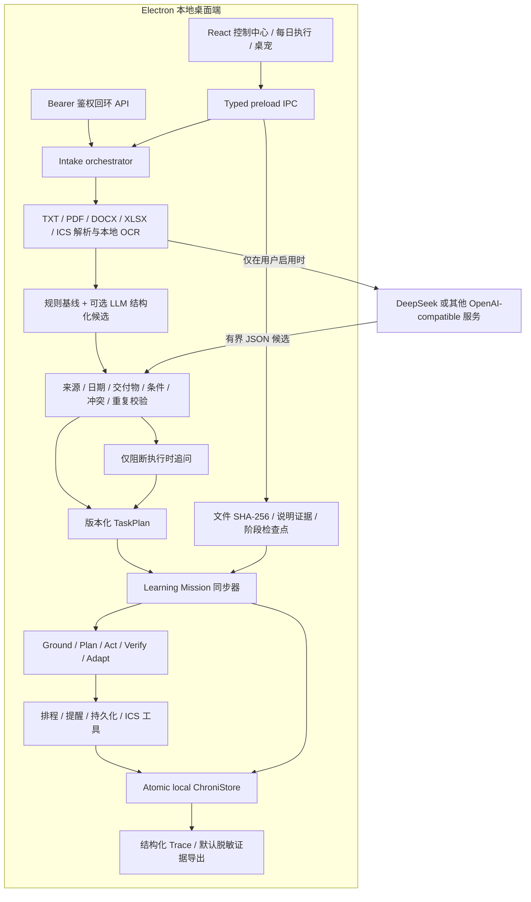

# Chroni 技术方案

## 总体架构



Electron 主进程拥有存储、文件解析、证据哈希、Agent 工具、通知、回环 API、更新状态和窗口位置。Renderer 不能直接访问 Node 或文件系统，只能调用 preload 暴露的窄接口。`ChroniStore` 使用原子 JSON 写入、备份恢复和旧状态兼容迁移。

## Learning Mission 领域模型

Learning Mission 是来源任务与当前 TaskPlan 的稳定投影，同时保留用户执行反馈：

```text
taskId / title / dueAt
goal / deliverables[] / successCriteria[]
milestones[] ← active TaskPlan steps
evidence[]   ← file metadata + SHA-256 or note
checkpoints[]← on-track / blocked / completed + actual effort
source name / excerpt / plannerSource
progress / evidenceCoverage / status / risk / nextAction
```

同步器遵循以下约束：

1. 每个来源任务至多对应一条稳定 Mission，旧状态升级时自动创建，任务删除时级联清理。
2. 目标、交付物和完成标准优先来自有来源的抽取结果与当前计划；缺失时使用保守规则，不凭空生成事实。
3. TaskPlan 步骤成为里程碑；检查点绑定里程碑后，本地 Store 同步步骤状态和任务进度。
4. 证据覆盖率按交付物是否拥有用户登记证据计算，不代表质量评分。
5. 原始课程来源不计为产出证据，模型不能写入“完成”状态。

## 数据流与信任边界

1. 文本或文件经 typed IPC 或鉴权回环 HTTP 进入。
2. 有界解析器提取文本；图片和无文本层 PDF 在本机使用 Tesseract OCR。
3. 本地规则始终产生基线；启用模型时，只发送必要文本片段和 schema，接收 JSON 候选。
4. 日期、来源、交付物、条件语言、必填字段、重复项、冲突和模型字段在本地校验。
5. 明确任务直接持久化；真正缺失或冲突的事实形成可恢复草稿与问题。
6. TaskPlan 只能通过本地 Store 方法生成、编辑、版本化与激活，随后同步 Learning Mission。
7. 学习执行 Agent 依据风险、slack、容量、里程碑和反馈调用本地工具，再验证覆盖和冲突。
8. 用户可登记产出文件。主进程流式计算 SHA-256，只存元数据，不存绝对路径和二进制内容。
9. 结构化 Trace 可在界面查看；导出默认移除标题、原文、路径、证据正文、密钥和模型隐藏推理，并附 SHA-256。

不可信边界包括来源文件、OCR 文本、HTTP 调用方和全部模型输出。可信状态转换仅位于 validation 与 Store 方法。任何导入文本都不能触发 Electron 命令。

## Agent 生命周期

### Ground

读取来源、任务、日期上下文和抽取证据，校验冲突与不确定性。信息明确时不得退化为追问；缺失项只有在阻断执行时才创建 clarification。

### Plan

读取目标、交付物、完成标准、步骤依赖、预计耗时、缓冲、工作时段和每日容量，生成或更新版本化 TaskPlan，并计算 slack 与风险。

### Act

比较现有安排和候选安排，调用重排、持久化、提醒或 ICS 工具。每个工具动作记录成功、跳过或失败原因。

### Verify

读取证据覆盖、用户检查点、实际投入、里程碑状态、高风险覆盖、未安排优先任务和容量溢出。这里记录的是结构化结果，不是模型 chain-of-thought。

### Adapt

受阻检查点会把对应步骤置为 blocked 并提高风险；顺利/完成检查点更新步骤状态与进度。Agent 再基于剩余工作和现实容量计算下一步，用户始终可以编辑或拒绝。

触发器包括手动、启动、每日和防抖任务变化。调度器会去重并发运行。在 GOAI Demo 中，自动巡检和通知被关闭，所有合成场景确定、隔离、可删除。

## Schema、恢复与 API

核心 schema 包括 `DdlItem`（兼容内部名称）、`SourceRecord`、`IntakeDraft`、`PendingClarification`、`TaskPlan`、`LearningMission`、`LearningMissionEvidence`、`LearningMissionCheckpoint`、`DailyTask`、`AgentRunResult` 和 `ChroniSnapshot`。

校验层限制文本、数组、标识符、日期、文件体积、模型字段和规划编辑。追问答案恢复原草稿并幂等地创建至多一个任务。模型/规划器失败会回退本地规则，不改写原始截止事实。

回环 API 提供 Mission 查询、文字证据、检查点和证据删除。任意文件路径不能通过 HTTP 登记；文件证据只允许桌面文件选择器经 IPC 处理，避免脚本把 Chroni 变成通用本机文件读取器。

## 模型与网关

Chroni 不训练或捆绑基础模型。用户可配置 DeepSeek 或其他 OpenAI-compatible 端点。受控内测请求可经过可选网关，其上游 Key、访问码哈希、限流、超时和 URL 均位于服务端环境变量。离线 Demo 和默认评测不会进行模型调用。

## 构建、验证与扩展

Vite 构建 Renderer，TypeScript 编译 Main，electron-builder 生成 Windows NSIS/Portable 和 macOS DMG/ZIP。GOAI 构建设置 `CHRONI_PET_ASSET_MODE=original`，扫描 Renderer 资源并打包许可清单。

测试覆盖解析、OCR 边界、Store 恢复、Learning Mission 同步、证据与检查点、Agent 行为、窗口几何、API 鉴权、更新、Demo 隔离、prompt injection、冲突处理和脱敏导出。CI 在 Windows、macOS、Linux 运行检查，并在 Ubuntu 运行 benchmark smoke。

当前未声称完成真实图片 OCR 基准、带凭据模型质量、长时间稳定性、安装包签名、公证或真实校园成效验证。能力契约见 `agent-capability-contracts.md`，后续扩展包括压缩包配额/解析 worker、日历与课程平台适配、授权真实评测集和知情同意试点。
