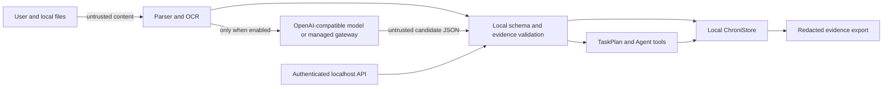

# Chroni threat model

Last reviewed: 2026-08-28. Scope: desktop app, local HTTP API, optional LLM gateway, updater, packaging, and GOAI demo/evidence paths.

## Assets and trust boundaries

Protected assets are user tasks, source material, planning preferences, API credentials, local API bearer tokens, update integrity, and the distinction between verified deadlines and model candidates.

Local files and model outputs are data, never privileged instructions. The renderer has no Node integration; state changes cross typed IPC or the token-authenticated `127.0.0.1` API. The model may propose candidates, but local validation and user confirmation retain authority over DDL facts.

## Controls

| Threat | Current control | Evidence | Residual risk |
| --- | --- | --- | --- |
| Prompt injection in documents | Injection-like lines are excluded from local task and clarification candidates; model prompts state that material is untrusted; output is parsed into bounded schemas. | `intake-goai-hardening.test.mjs`, validation tests | Novel semantic attacks may evade keyword screening; no model output may directly execute commands. |
| HTML/Markdown injection | File text is parsed as text; React escapes rendered strings; HTML tags are removed in rule normalization. | renderer architecture, intake tests | External links in source text are not automatically opened. |
| Oversized input | Renderer limits each file to 18 MiB; API body is capped at 32 MiB; parsers have text/document limits; OOXML preflight caps 2,000 entries and 64 MiB expanded size. | `filesFromFileList`, `MAX_API_BODY_BYTES`, intake safety tests | Pathological parser CPU still needs worker isolation and cancellation. |
| ZIP bomb / malformed archive | Before DOCX/XLSX parsing, Chroni checks the ZIP magic, central-directory bounds, encryption, ZIP64/multipart use, entry count, expanded size, and per-entry/total compression ratio. | `assertSafeOfficeArchive`, `intake-safety.test.mjs` | The parser still runs in the main process; future limits should also use a worker timeout. |
| Path traversal and forged extension | OOXML archive entries reject absolute, drive-qualified, NUL, and `..` paths; forged DOCX/XLSX content fails magic/directory checks. Local API requires a random bearer token. | archive traversal and forged-extension tests, API tests | Other supported formats rely on their parser signatures; a compromised same-user process with the bearer token can request readable local paths. |
| Malicious dates and Unicode confusion | Date parser validates calendar values and bounded input; OCR reliability checks replacement/control characters. | deadline and OCR tests | Visual homoglyph detection is incomplete. |
| Invalid or oversized model JSON | Bounded response parsing, candidate validation, date grounding, and local rules fallback. | LLM/intake/task-plan tests | Provider-side retention follows the configured provider's terms. |
| Model overwrites an original DDL | Conditional/conflicting deadlines become confirmation drafts; TaskPlan cannot change task due time. | conflict regression tests, scenario C | Users can still confirm an incorrect source, so evidence remains visible. |
| Duplicate imports | Store reconciliation and idempotent clarification answers prevent duplicate task occurrences. | store integrity and clarification tests | Semantically equivalent but heavily paraphrased sources can still require manual cleanup. |
| Public gateway abuse or cost exhaustion | Provider key stays server-side; desktop requests are constrained by source-network and global minute/day/concurrency quotas, prompt/output caps, upstream timeout, and provider-side spend limits. Raw IP and prompts are excluded from application logs. | gateway public-access, quota, logging, and client-header tests | The public client marker can be imitated and in-memory quotas reset after redeploy; provider-side budget limits remain mandatory. |
| Gateway timeout, 429, 5xx, offline | Typed errors and local extraction/planning fallback; model benchmark is opt-in. | gateway tests, offline benchmark | Complex semantic extraction is weaker without a model. |
| Secret or personal data in diagnostics | API keys are absent from snapshots; evidence export removes titles, raw text, paths, free-form summaries, and credentials. | evidence report test | Ordinary application logs are not a complete diagnostic package and require continued review. |
| Update or installer tampering | GitHub workflow builds artifacts and SHA-256 checksums; Electron fuses constrain runtime. | release workflow, packaging tests | Public code signing/notarization is credential-dependent and not proven by this source tree. |

## Credential handling

Custom model keys are encoded through Electron `safeStorage` when supported. Safe storage is initialized lazily only while encrypting or decrypting an explicit custom key. Managed mode has no client credential and discards obsolete managed access codes during migration without decrypting them. Unsigned direct macOS builds disable Chromium's unused Cookie Encryption fuse, so ordinary startup and managed-model use neither check nor initialize `Chroni Safe Storage`; Chroni has no persistent browser login cookies. Signed direct and store builds keep cookie encryption enabled because their stable identity can be authorized consistently by Keychain. The managed DeepSeek key exists only in server environment variables. The local API publishes a random bearer token in a user-local discovery file and listens only on loopback. Secrets must never enter committed `.env` files, screenshots, benchmark cases, traces, or support issues.

## Deletion and isolation

Normal state is stored in the Electron user-data directory as `chroni-state.json`. The sample-data tool uses the separate `sample-data` namespace; loading a sample recreates only that directory, and exiting deletes it before returning to the primary Store. Users can open the storage directory from the app and remove local state after quitting Chroni. Managed-provider deletion and retention are governed by the selected provider.

## Security test backlog

P1 work: parser worker isolation/timeouts, MIME signature checks for formats beyond OOXML/PDF parser validation, Unicode confusable detection, signed Windows installers, notarized macOS builds, and a redacted diagnostic-bundle test. Security reports follow `SECURITY.md`.
